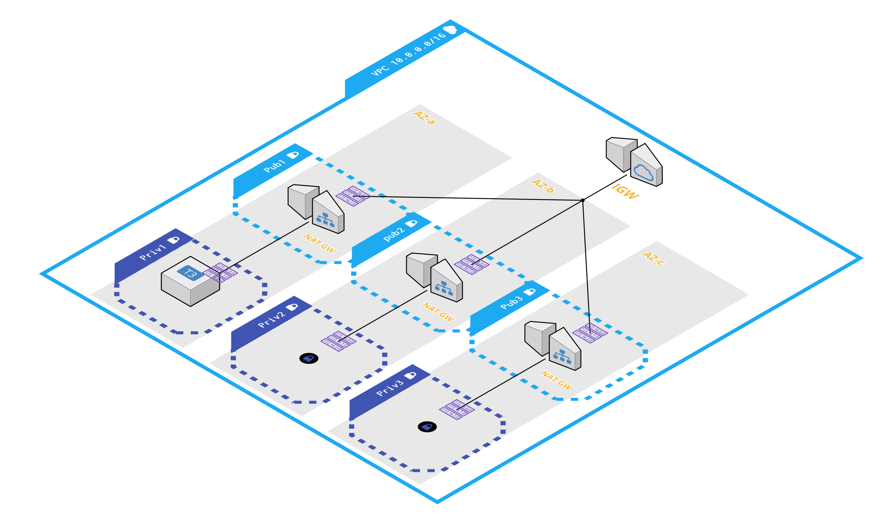

#Infrastructure

how is the code organized:

    live
    ├── modules
    │   ├── aws-ec2
    │   ├── aws-nat
    │   └── aws-vpc
    │
    ├── stage-type
    │   └── region 
    │       ├── common 
    │       │   ├── nat
    │       │   └── vpc-subnets
    │       └── env 
    │           └── aws-ec2        
    │
    └── terragrunt.hcl (parent or root)
    
